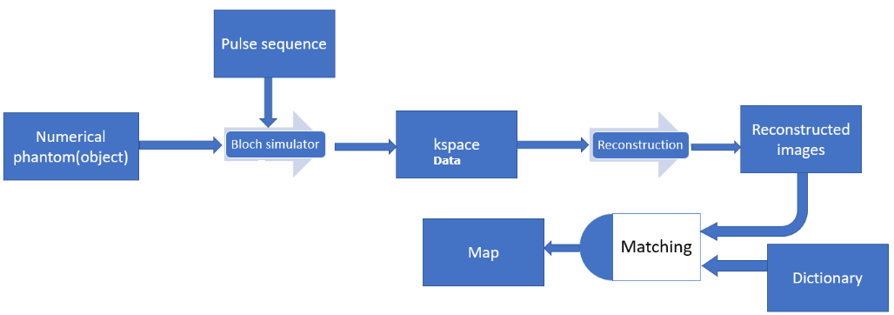

# A simulator for MR Fingerprinting(MRF)

This simulator was initialy developed to provide a tool for testing various reconstruction algorithms and pulse sequences under the MRF framework. 

The simulator does not only simulate MRF steps like dictionary generation and patern mattching. It also simulates the whole MRI process by MR machines such as MR image acquisition through the application of pulse sequences. Additionaly, it generates numerical phantoms. The general block diagram of the simulator is shown below

### demo.m
Starter file that calls all necessary functions.

### spiral_trajectory.m
This function generates a variable density spiral trajectory along with the corresponding gradient and k-space locations. The main constraints for designing the trajectory are the field of view and slew rate. The design is based on the paper by Dong-hyun Kim et al., titled "Simple Analytic Variable Density Spiral Design," published in Magnetic Resonance in Medicine 50:214-219 (2003). This approach has been utilized by Matthieu Guerquin-Kern in 2012.

### rewinder.m
The function is employed to nullify the 0th moment of the gradients, as outlined in Krishna S. Nayak et al.'s paper titled "Spiral Balanced Steady-State Free Precession Cardiac Imaging," published in Magnetic Resonance in Medicine 53:1468–1473 (2005).

### generate_all_trajectories.m
This function is used to generate the rotated version of the first spiral for all trajectories with a linear rotation angle.

### MRF_sampling.m
Here, the function generates a series of undersampled data using discrete Bloch simulation, which is subsequently reconstructed to generate the MRF series images. The inputs for this process include numerical phantoms, off-resonance frequencies, and the pulse sequence.

### Recon_image.m
This function employs Jeff Fessler's NUFFT (Non-Uniform Fast Fourier Transform) toolbox to reconstruct the sampled data.
### dict_true
This function generates MRF dictionary with pseudo-random TRs and flip angles for a given T1, T2 and off resonance values of tissues.
Customized from: https://github.com/mgolbabaee/CoverBLIP

### fast_matching.m
This function conducts dot product-based pattern matching between a normalized dictionary and the acquired images, resulting in T1, T2, off-resonance frequency, and proton density parameter maps. This custom implementation is adapted from Dan Ma et al.'s work titled "Magnetic Resonance Fingerprinting," published in Nature, vol. 495, p. 187–192, 2013.    

### Note
The simulator requires approximately 16 hours to complete on a computer equipped with a Core i7 CPU @ 2.20GHz and 16GB RAM. 
The results of the simulator can be viewed on the next page.

## Results

Ground truth cylindrical phantoms: (a) proton density, (b) T1, (c) T2, (d) off-resonance

Ground truth brain phantoms:(a) proton density, (b) T1, (c) T2, (d) off-resonance

Four of the highly aliased time series images acquired for custom (top row) and brain (bottom row) phantoms

Quantitative T1(first column), T2(second column) and off resonace(third column) maps generated after pattern matching 